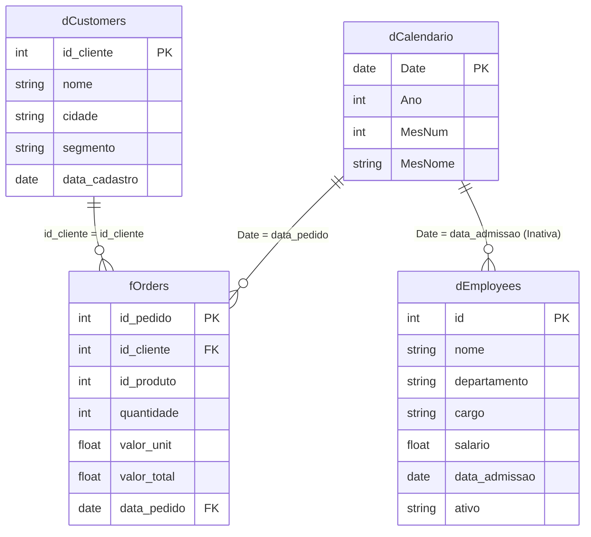

# Modelagem de Dados — Star Schema

Para tirar o máximo proveito do Power BI, do DAX e garantir performance, a modelagem ideal é o **Star Schema** (Esquema Estrela). 

Ao trabalhar com os datasets fornecidos (`employees.csv`, `customers.csv`, `orders.csv`), você deve organizar os relacionamentos da seguinte forma:

## Diagrama de Relacionamentos (Modelo Dimensional)

## Como configurar no Power BI

1. **dCalendario (Dimensão Calendário)**:
   - Crie usando `CALENDARAUTO()` ou uma query M (ver `time_intelligence.md`).
   - Marque a tabela como "Tabela de Data" na fita Modelagem.

2. **dCustomers (Dimensão Clientes)**:
   - Tabela `customers.csv`.
   - Contém o cadastro único de clientes.
   - Relacionamento: `1:*` com a tabela `fOrders` via `id_cliente`. Sentido do filtro: Único (dCustomers filtra fOrders).

3. **dEmployees (Dimensão Funcionários)**:
   - Tabela `employees.csv`.
   - Pode ser analisada separadamente (ex: total de folha) ou relacionada se houvesse uma tabela Fato de Vendedores.
   - O relacionamento com `dCalendario` seria via `data_admissao` (para contar contratações no tempo).

4. **fOrders (Fato Pedidos)**:
   - Tabela `orders.csv`.
   - Contém os eventos e métricas de valor.
   - Relacionamentos estabelecidos recebem os filtros das dimensões.

## Boas Práticas (Best Practices)

1. **Evite Snowflakes desnecessários**: Tabelas de dimensão ligadas a outras tabelas de dimensão em cadeia degradam a performance. Tente planificar (achatar) no Power Query (Merge).
2. **Cardinalidade Oculta**: Colunas que ligam tabelas (PK/FK) devem ter seus resumos automáticos (Soma, Contagem) desativados ("Não resumir") e, preferencialmente, ocultadas da visualização final (hide in report view).
3. **Evite Bidirecional**: Relacionamentos bidirecionais (Both) causam ambiguidades no modelo e lentidão. Mantenha os filtros fluindo da Dimensão `1` para a Fato `*`.
