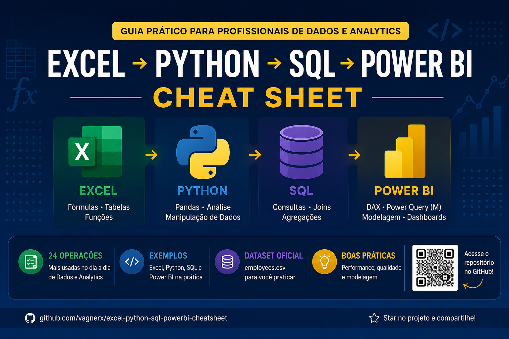

# Excel → Python → SQL → Power BI Cheat Sheet

Guia prático para profissionais de Dados e Analytics.

## Tecnologias

| Excel    | Python | SQL      | Power BI |
| -------- | ------ | -------- | -------- |
| Fórmulas | Pandas | ANSI SQL | DAX e M  |

## Conteúdo

- 24 operações de dados
- Exemplos executáveis
- Datasets para prática
- Boas práticas
- Modelagem dimensional

## Acesse o repositório

https://github.com/vagnerx/excel-python-sql-powerbi-cheatsheet

