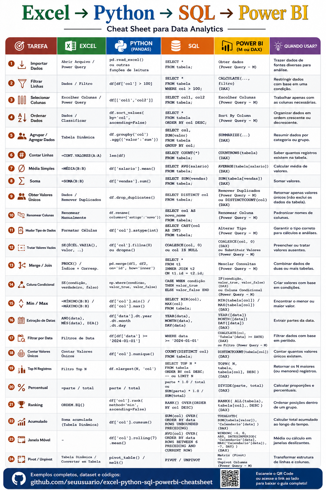

# O Guia Definitivo: Excel → Python → SQL → Power BI

Este repositório é o guia prático e executável definitivo para profissionais de Dados e Analytics que desejam traduzir seus conhecimentos entre as principais ferramentas do mercado.

---

## 🎯 Objetivo

Inspirado nas clássicas "Cheat Sheets" visuais da área de dados, este projeto vai além da imagem. Ele oferece os **códigos práticos, explicados e testados** para 24 operações fundamentais de análise, transformando teoria visual em scripts prontos para rodar no seu dia a dia.

*(Imagem de referência original que inspirou este repositório)*

> 👤 **Autor:** [Vagner Xavier](https://www.linkedin.com/in/vxavier/)  
> 📰 **Artigo Completo:** *(Link para o post do LinkedIn será adicionado aqui em breve)*

---

## 🚀 Acesso Rápido às Entregas

Tudo o que você precisa para praticar localmente:

### 1. [Dataset Prático](datasets/employees.md)
Três datasets inter-relacionados (Employees, Customers, Orders) para treinar as operações.

### 2. [Exemplos em Python (Pandas)](examples/python/)
- Scripts `.py` completos para cada grupo de operações.
- Notebook interativo `.ipynb` (com botão para abrir direto no Google Colab).

### 3. [Exemplos em SQL](examples/sql/)
- Banco de dados SQLite `.db` populado e pronto para uso.
- Scripts SQL demonstrando agregações, *JOINs*, cruzamentos e *Window Functions*.
- Integração e uso via Python/Pandas para exibir os resultados diretamente.

### 4. [Exemplos em Excel](examples/excel/)
- Planilha completa gerada com as 24 lógicas já montadas em células, formatadas e comentadas.

### 5. [Exemplos em Power BI](examples/powerbi/)
- Modelagem *Star Schema* documentada.
- Linguagem M e *Time Intelligence*.
- Código limpo de todas as métricas DAX.

---

## 📖 Como navegar neste site

Use o menu lateral (ou o ícone de hambúrguer no celular) para navegar pelas 24 operações detalhadas. Cada página foca em uma tarefa específica e mostra como executá-la nas 4 tecnologias lado a lado, apontando armadilhas e boas práticas.

*Seja bem-vindo e bons estudos!*
